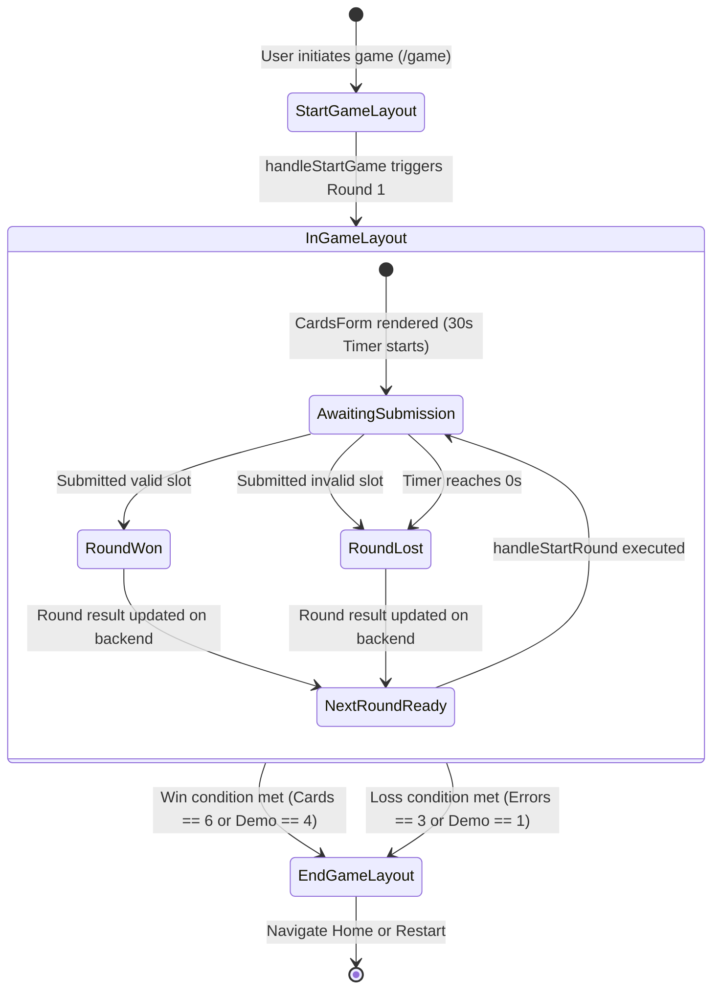
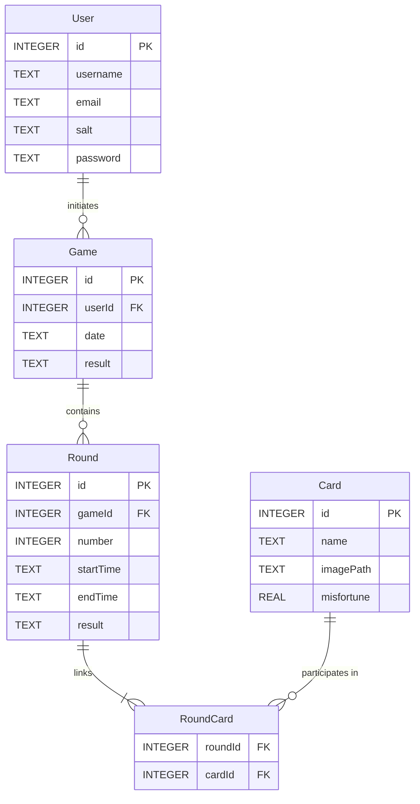
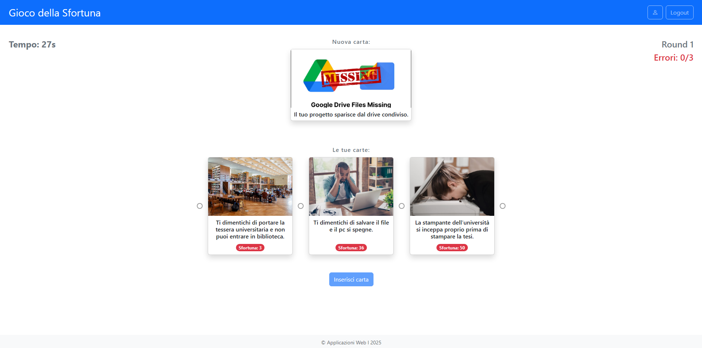
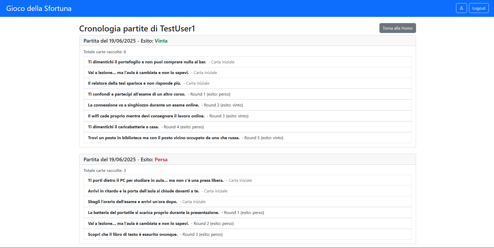

# Misfortune Game

## Table of Contents

1. [Project Overview](#project-overview)
2. [System Architecture](#system-architecture)
   - [High-Level Architectural Topology](#high-level-architectural-topology)
   - [State Transition and Game Lifecycle Model](#state-transition-and-game-lifecycle-model)
3. [Database Architecture and Data Models](#database-architecture-and-data-models)
   - [Relational Schema Design](#relational-schema-design)
   - [Entity Models](#entity-models)
   - [Data Access Object (DAO) Implementation](#data-access-object-dao-implementation)
4. [Backend Engineering and Security Architecture](#backend-engineering-and-security-architecture)
   - [HTTP Server Configuration](#http-server-configuration)
   - [Authentication and Session Lifecycle](#authentication-and-session-lifecycle)
   - [Request Validation and Sanitization Pipeline](#request-validation-and-sanitization-pipeline)
   - [Anti-Cheat and Information Hiding Mechanism](#anti-cheat-and-information-hiding-mechanism)
5. [RESTful API Specification](#restful-api-specification)
   - [Game Management Endpoints](#game-management-endpoints)
   - [Round Management Endpoints](#round-management-endpoints)
   - [Card Management Endpoints](#card-management-endpoints)
   - [User and Session Management Endpoints](#user-and-session-management-endpoints)
6. [Frontend Engineering and Client Architecture](#frontend-engineering-and-client-architecture)
   - [Single-Page Application Structure](#single-page-application-structure)
   - [Component Hierarchy and Responsibilities](#component-hierarchy-and-responsibilities)
   - [Form Submission Pipeline via React 19 Action States](#form-submission-pipeline-via-react-19-action-states)
   - [Timer Concurrency and Race Condition Elimination](#timer-concurrency-and-race-condition-elimination)
   - [Client-Side Routing and Navigation Guards](#client-side-routing-and-navigation-guards)
7. [Client Application Routes](#client-application-routes)
8. [Setup, Seeding, and Execution](#setup-seeding-and-execution)
   - [Environment Requirements](#environment-requirements)
   - [Database Seeding and Initialization](#database-seeding-and-initialization)
   - [Server Configuration and Startup](#server-configuration-and-startup)
   - [Client Configuration and Startup](#client-configuration-and-startup)
9. [Preconfigured Test Credentials](#preconfigured-test-credentials)
10. [Interface Screenshots](#interface-screenshots)
11. [License](#license)

## Project Overview

Misfortune Game is a full-stack web application designed around an order-estimation card game based on misfortune indexes. Players are presented with scenarios depicting misfortunes of varying degrees of severity. Each card is associated with a numerical misfortune index rating its negative impact.

The core gameplay loop requires the player to maintain an array of misfortune cards sorted in ascending order of their misfortune values. Upon game initialization, three starter cards with known misfortune values are granted and sorted. In each subsequent round, the player receives a newly drawn, unrevealed card showing solely an image and a descriptive text label. The numerical misfortune value remains concealed on the server to prevent inspection. The player is allotted 30 seconds to determine the relative rank of the target card within their current hand and submit the chosen insertion slot via an interactive form. 

Successful placement updates the hand and advances the score toward the target win condition (6 cards for authenticated users; 4 cards for guest/demo users). Submitting an incorrect position or permitting the countdown timer to expire registers an error and discards the card. Reaching the error threshold (3 errors for authenticated users; 1 error for guest users) triggers a loss condition. The system records all played games, individual round timelines, and card outcomes in a relational SQLite store, allowing authenticated players to review historical match statistics.

## System Architecture

The software is structured as a decoupled client-server architecture. The backend exposes a stateless RESTful HTTP API complemented by cookie-based session management, while the frontend is constructed as a React Single-Page Application bundled via Vite.

```
+-------------------------------------------------------------+
|                     Client Browser                          |
|  +-------------------------------------------------------+  |
|  |             React Single-Page Application             |  |
|  |  [App.jsx] -> [DefaultLayout.jsx] -> [GamePage.jsx]   |  |
|  |  - React Router (Navigation Guards)                   |  |
|  |  - Form Action Hook (useActionState)                  |  |
|  |  - Asynchronous HTTP Client (API.mjs)                 |  |
|  +-------------------------------------------------------+  |
+------------------------------|------------------------------+
                               |
                   HTTP / CORS / Credentials
                               |
+------------------------------v------------------------------+
|                      Node.js Server                          |
|  +-------------------------------------------------------+  |
|  |                Express Application Server             |  |
|  |  - express-validator Pipeline                         |  |
|  |  - Passport.js Session Authentication                 |  |
|  |  - Static Asset Delivery (/images)                    |  |
|  |  - Route Handlers (index.mjs)                         |  |
|  +---------------------------|---------------------------+  |
|                              v                              |
|  +-------------------------------------------------------+  |
|  |             Data Access Layer (dao.mjs)               |  |
|  |  - Parameterized SQLite Queries                       |  |
|  |  - Scrypt Password Hashing & Timing-Safe Check        |  |
|  +---------------------------|---------------------------+  |
+------------------------------|------------------------------+
                               |
                   Local File System I/O
                               |
+------------------------------v------------------------------+
|                     SQLite Storage                          |
|                   [database.db]                             |
+-------------------------------------------------------------+
```

### High-Level Architectural Topology

1. **Presentation Layer (Frontend):** Implemented in React using functional components, standard React hooks (`useState`, `useEffect`), and React 19's `useActionState`. Bootstrap and React-Bootstrap provide the structural layout, ensuring responsive grid boundaries across viewports.
2. **API Communication Layer:** Centralized in `API.mjs`, wrapping standard `fetch` invocations with explicit HTTP headers, credential transmission flags (`credentials: 'include'`), and unified error parsing.
3. **Application & Routing Layer (Backend):** Powered by Express (`index.mjs`). Incorporates logging middleware (`morgan`), Cross-Origin Resource Sharing (`cors`), static file exposure for card imagery, and JSON body parsing.
4. **Security Layer:** Passport.js integrated with `passport-local` and `express-session`. User password validation relies on Node.js standard cryptographic primitives (`crypto.scrypt` and `crypto.timingSafeEqual`).
5. **Persistence Layer:** Structured around a local SQLite database (`database.db`) interacted with through asynchronous Promise wrappers in `dao.mjs`.

### State Transition and Game Lifecycle Model

The client-side game engine inside `GamePage.jsx` implements a finite-state machine coordinating view states and backend synchronization:



## Database Architecture and Data Models

The application utilizes SQLite for structured relational data storage. Schema integrity is maintained using explicit primary and foreign key constraints enabled at connection initialization (`PRAGMA foreign_keys = ON;`).



### Relational Schema Design

#### Table `User`
Stores user profile information, identity credentials, and cryptographic parameters required for authentication.
- `id` (INTEGER, Primary Key, Autoincrement): Unique user identifier.
- `username` (TEXT, Not Null): Display name of the user.
- `email` (TEXT, Not Null, Unique): Email used as the primary authentication principal.
- `salt` (TEXT, Not Null): Cryptographic per-user hexadecimal salt string.
- `password` (TEXT, Not Null): Hexadecimal string representing the hashed password derived via `crypto.scrypt`.

#### Table `Game`
Maintains match-level session records for both registered and guest users.
- `id` (INTEGER, Primary Key, Autoincrement): Unique game identifier.
- `userId` (INTEGER, Foreign Key referencing `User(id)`, Nullable): Identifies the owning user; set to `NULL` for unauthenticated guest demo matches.
- `date` (TEXT, Not Null): Date stamp formatted as `YYYY-MM-DD`.
- `result` (TEXT, Nullable): Final game status. Valid states are `'win'`, `'loss'`, or `NULL` if active.

#### Table `Round`
Maintains records for individual rounds conducted within a given game instance.
- `id` (INTEGER, Primary Key, Autoincrement): Unique round identifier.
- `gameId` (INTEGER, Foreign Key referencing `Game(id)`, Not Null): Owning game session.
- `number` (INTEGER, Not Null): Sequential round index (`0` for initial hand allocation, `1..N` for subsequent turns).
- `startTime` (TEXT, Not Null): Timestamp formatted as `YYYY-MM-DD HH:mm:ss`.
- `endTime` (TEXT, Nullable): Timestamp marking round completion.
- `result` (TEXT, Nullable): Status of the round (`'win'`, `'loss'`, or `NULL` while pending).

#### Table `Card`
Contains the static catalog of available misfortune scenarios.
- `id` (INTEGER, Primary Key, Autoincrement): Unique card identifier.
- `name` (TEXT, Not Null): Descriptive text outlining the unfortunate event.
- `imagePath` (TEXT, Not Null): Relative URL pointing to the static image asset.
- `misfortune` (REAL, Not Null): Numerical index defining severity (1.0 to 100.0).

#### Table `RoundCard`
Acts as an associative junction table modeling the Many-to-Many relationship between rounds and cards.
- `roundId` (INTEGER, Foreign Key referencing `Round(id)`, Not Null): Target round.
- `cardId` (INTEGER, Foreign Key referencing `Card(id)`, Not Null): Associated card.
- Composite primary constraint: Implicitly enforces referential binding.

### Entity Models

The entity structures are standardized across both server and client execution environments via mirror files named `models.mjs`.

- `Card(name, imagePath, misfortune, id = null)`: Encapsulates card descriptors. The client-side constructor defaults `misfortune` to `null` to accommodate concealed cards.
- `Game(userId, date = null, cards = [], result = null, id = null)`: Models game state. Sanitizes date fields via Day.js to uniform `YYYY-MM-DD` strings.
- `Round(gameId, cards = [], number = null, startTime = null, endTime = null, id = null, result = null)`: Represents a round cycle, standardizing ISO date-time strings (`YYYY-MM-DD HH:mm:ss`).
- `User(username, email, salt = null, password = null, id = null)`: Domain representation of a user. The client model omits the `salt` and `password` properties to prevent memory leaks of security-sensitive attributes.

### Data Access Object (DAO) Implementation

Persistent operations are defined in `dao.mjs`. All database operations are wrapped in native JavaScript Promises, abstracting SQLite's callback pattern:

- **Parameterized Execution:** Every query uses `?` placeholders to enforce parameter binding.
- **Round Creation Atomicity (`addRound`):** Inserts the master `Round` row, iterates over associated cards to populate `RoundCard`, and executes a rollback query (`DELETE FROM Round WHERE id = ?`) within the `catch` block if any secondary insertion fails.
- **Deduplication Filter (`listRandomCardsForGame`):** Employs a nested subquery to exclude cards already linked to any previous round of the same game instance:
  ```sql
  SELECT * FROM Card
  WHERE id NOT IN (
      SELECT RoundCard.cardId
      FROM RoundCard
      JOIN Round ON RoundCard.roundId = Round.id
      WHERE Round.gameId = ?
  )
  ORDER BY RANDOM()
  LIMIT ?
  ```
- **Relational Reconstitution (`listUserGamesWithRoundsAndCards`):** Implements a two-pass mapping algorithm. A multi-table `JOIN` returns flat rows; the DAO parses these records using a `Map<gameId, Game>` data structure, progressively reconstituting nested `Round` arrays and child `Card` collections while preserving historical order.

## Backend Engineering and Security Architecture

### HTTP Server Configuration

The Express backend configured in `index.mjs` operates on port `3001` with the following middleware sequence:
1. **Body Parser:** `express.json()` processes incoming payloads with content type `application/json`.
2. **Request Logger:** `morgan('dev')` streams structured HTTP access logs to standard output.
3. **Static Asset Server:** Exposes the image repository under the mount point `/images` mapped to the local directory containing card artwork.
4. **CORS Configuration:** `cors(corsOptions)` permits requests originating exclusively from `http://localhost:5173`, allowing credentials transmission (`credentials: true`) to exchange session cookies.
5. **Session Management:** `express-session` handles HTTP session cookies (`connect.sid`), configured with `resave: false` and `saveUninitialized: false`.
6. **Passport Integration:** `passport.authenticate('session')` deserializes the user identity from session storage into `req.user`.

### Authentication and Session Lifecycle

User authentication follows the standard Passport.js Local Strategy workflow, backed by Node.js cryptographic modules:

1. **Password Verification (`getUser` in `dao.mjs`):**
   - Retrieves the user row by unique email address.
   - Extracts the 32-byte salt stored during registration.
   - Executes `crypto.scrypt(password, row.salt, 32, callback)` to generate a derived key.
   - Executes `crypto.timingSafeEqual(Buffer.from(row.password, 'hex'), hashedPassword)` to compare the hash against the stored hash in constant time, preventing timing analysis attacks.
2. **Serialization & Deserialization:**
   - `passport.serializeUser` packs the user identity into session state.
   - `passport.deserializeUser` reattaches the validated user object on subsequent requests.
3. **Route Authorization Middleware (`isLoggedIn`):**
   - Evaluates `req.isAuthenticated()`. If false, execution terminates immediately with HTTP status `401 Unauthorized` and payload `{ error: 'Not authorized' }`.

### Request Validation and Sanitization Pipeline

Input validation is enforced using `express-validator` chains directly attached to route declarations. The middleware pipeline employs the `.bail()` modifier to halt chain execution immediately upon encountering an invalid condition:

- **Positive Integer & Null Validation:** Implemented via a custom validator `intOrNullValidator`:
  ```javascript
  const intOrNullValidator = (value, { path }) => {
      if (value === null) return true;
      const n = Number(value);
      if (!isNaN(n) && Number.isInteger(n) && n > 0) return true;
      throw new Error(`Field "${path}" must be either null or a positive integer`);
  };
  ```
- **Type Coercion and Boundary Checks:**
  - Route parameter `:gameId` and `:roundId`: Validated via `isInt({ min: 1 })`.
  - Query parameter `n`: Validated via `isInt({ min: 1 })`.
  - Query parameter `getMisfortune`: Validated with `isBoolean()` and parsed into native boolean via `.toBoolean()`.
  - Round payload: Validates array presence (`isArray({ min: 1 })`) and verifies that each entry contains a positive integer ID (`body('cards.*.id').isInt({ min: 1 })`).
- **Standardized Error Responses:** Handlers evaluate `validationResult(req)`. If errors are detected, execution terminates with HTTP status `400 Bad Request` returning `{ errors: errors.array() }`.

### Anti-Cheat and Information Hiding Mechanism

To maintain game integrity, clients cannot access misfortune ratings prematurely:
1. **Concealed Draw:** When drawing a new card for an active round, the frontend requests `GET /api/games/:gameId/randomCards?n=1&getMisfortune=false`. The DAO strips the `misfortune` field, setting it to `null`.
2. **Client-Side Blind State:** The client renders the target card (`GameCard.jsx`) displaying only its title and visual graphic.
3. **Post-Decision Query:** The client only queries `GET /api/cards/:cardId` after the user selects an insertion slot and clicks the submission button. The frontend then verifies the insertion boundaries against the true misfortune value, records the round outcome, and synchronizes the result back to the server via `PATCH /api/rounds/:roundId`.

## RESTful API Specification

### Game Management Endpoints

#### `POST /api/games`
Initializes a new game session.
- **Request Headers:** `Content-Type: application/json`
- **Request Body:**
  ```json
  {
    "userId": 1
  }
  ```
  *(Note: `userId` may be `null` for unauthenticated demo games).*
- **Validation Rules:** `userId` must be `null` or a positive integer.
- **Success Response (201 Created):**
  ```json
  {
    "id": 12,
    "userId": 1,
    "date": "2026-09-15",
    "result": null,
    "cards": []
  }
  ```
- **Error Responses:** `400 Bad Request`, `500 Internal Server Error`.

#### `GET /api/games/:gameId/randomCards`
Retrieves a set of random cards not yet utilized in the specified game session.
- **Request Parameters:**
  - `gameId` (URL path, integer, required): ID of the target game.
  - `n` (Query string, integer, required): Number of cards to retrieve.
  - `getMisfortune` (Query string, boolean, required): Whether to include the numerical misfortune values.
- **Validation Rules:** `gameId` >= 1, `n` >= 1, `getMisfortune` must be boolean.
- **Success Response (200 OK):**
  ```json
  [
    {
      "id": 5,
      "name": "Ti si apre la zip dello zaino e perdi appunti importanti.",
      "imagePath": "/images/cards/losing-notes.png",
      "misfortune": 5.0
    }
  ]
  ```
- **Partial Content Response (206 Partial Content):** Returned if the available pool contains fewer cards than requested `n`.
- **Error Responses:** `400 Bad Request`, `404 Not Found` (no cards remaining), `500 Internal Server Error`.

#### `PATCH /api/games/:gameId`
Finalizes the outcome of a game session.
- **Request Parameters:** `gameId` (URL path, integer, required).
- **Request Body:**
  ```json
  {
    "result": "win"
  }
  ```
- **Validation Rules:** `gameId` >= 1, `result` must be a non-empty string (`"win"` or `"loss"`).
- **Success Response (200 OK):**
  ```json
  {
    "id": 12,
    "userId": 1,
    "date": "2026-09-15",
    "result": "win",
    "cards": []
  }
  ```
- **Error Responses:** `400 Bad Request`, `404 Not Found`, `500 Internal Server Error`.

---

### Round Management Endpoints

#### `POST /api/rounds`
Instantiates a new round within an active game session. Automatically increments the sequential round number based on existing game rounds.
- **Request Body:**
  ```json
  {
    "gameId": 12,
    "cards": [
      { "id": 5 }
    ]
  }
  ```
- **Validation Rules:** `gameId` must be a positive integer; `cards` must be a non-empty array of objects, each possessing a positive integer `id`.
- **Success Response (201 Created):**
  ```json
  {
    "id": 34,
    "gameId": 12,
    "number": 1,
    "startTime": "2026-09-15 16:30:00",
    "endTime": null,
    "result": null,
    "cards": [
      {
        "id": 5,
        "name": "Ti si apre la zip dello zaino e perdi appunti importanti.",
        "imagePath": "/images/cards/losing-notes.png",
        "misfortune": null
      }
    ]
  }
  ```
- **Error Responses:** `400 Bad Request`, `404 Not Found`, `500 Internal Server Error`.

#### `PATCH /api/rounds/:roundId`
Updates the outcome of a specific round.
- **Request Parameters:** `roundId` (URL path, integer, required).
- **Request Body:**
  ```json
  {
    "result": "win"
  }
  ```
- **Validation Rules:** `roundId` >= 1, `result` must be a non-empty string (`"win"` or `"loss"`).
- **Success Response (200 OK):**
  ```json
  {
    "id": 34,
    "gameId": 12,
    "number": 1,
    "startTime": "2026-09-15 16:30:00",
    "endTime": null,
    "result": "win",
    "cards": []
  }
  ```
- **Error Responses:** `400 Bad Request`, `404 Not Found`, `500 Internal Server Error`.

---

### Card Management Endpoints

#### `GET /api/cards/:cardId`
Fetches complete metadata for an individual card, including its verified misfortune rating.
- **Request Parameters:** `cardId` (URL path, integer, required).
- **Validation Rules:** `cardId` >= 1.
- **Success Response (200 OK):**
  ```json
  {
    "id": 5,
    "name": "Ti si apre la zip dello zaino e perdi appunti importanti.",
    "imagePath": "/images/cards/losing-notes.png",
    "misfortune": 5.0
  }
  ```
- **Error Responses:** `400 Bad Request`, `404 Not Found`, `500 Internal Server Error`.

---

### User and Session Management Endpoints

#### `POST /api/sessions`
Authenticates a user via Passport local credentials strategy and sets an HTTP-only session cookie.
- **Request Body:**
  ```json
  {
    "username": "testuser1@mail.com",
    "password": "password"
  }
  ```
- **Success Response (201 Created):**
  ```json
  {
    "id": 1,
    "username": "TestUser1",
    "email": "testuser1@mail.com"
  }
  ```
- **Error Responses:** `401 Unauthorized` (`Incorrect username or password.`).

#### `GET /api/sessions/current`
Checks authentication state and retrieves the currently active user context.
- **Success Response (200 OK):**
  ```json
  {
    "id": 1,
    "username": "TestUser1",
    "email": "testuser1@mail.com"
  }
  ```
- **Error Responses:** `401 Unauthorized` (`{ "error": "Not authenticated" }`).

#### `DELETE /api/sessions/current`
Destroys the current authenticated user session and invalidates the session cookie.
- **Success Response (200 OK):** Empty response body.

#### `GET /api/users/:userId/games`
Retrieves the complete historical record of completed matches for the specified user, including nested rounds and cards.
- **Authorization:** Requires an active authenticated session via `isLoggedIn`.
- **Request Parameters:** `userId` (URL path, integer, required).
- **Success Response (200 OK):**
  ```json
  [
    {
      "id": 12,
      "userId": 1,
      "date": "2026-09-15",
      "result": "win",
      "cards": [],
      "rounds": [
        {
          "id": 33,
          "gameId": 12,
          "number": 0,
          "startTime": "2026-09-15 16:28:10",
          "endTime": null,
          "result": null,
          "cards": [
            {
              "id": 1,
              "name": "Ti si rompe la penna proprio durante l’esame.",
              "imagePath": "/images/cards/broken-pen.jpg",
              "misfortune": 1.0
            }
          ]
        },
        {
          "id": 34,
          "gameId": 12,
          "number": 1,
          "startTime": "2026-09-15 16:30:00",
          "endTime": null,
          "result": "win",
          "cards": [
            {
              "id": 5,
              "name": "Ti si apre la zip dello zaino e perdi appunti importanti.",
              "imagePath": "/images/cards/losing-notes.png",
              "misfortune": 5.0
            }
          ]
        }
      ]
    }
  ]
  ```
- **Error Responses:** `401 Unauthorized`, `404 Not Found` (no games on record), `500 Internal Server Error`.

## Frontend Engineering and Client Architecture

### Single-Page Application Structure

The client application is built with React 19 and React Router v7. React root initialization is handled in `main.jsx`, injecting `App.jsx` inside a `BrowserRouter` context:

```
App.jsx (Root State & Auth Context Provider)
└── DefaultLayout.jsx (Header, Notifications, Footer)
    ├── NavHeader (Navigation Controls & Access Guard)
    ├── Outlet
    │   ├── HomePage.jsx (Landing & Rules Engine)
    │   ├── GamePage.jsx (State Machine & Game Controller)
    │   │   ├── StartGameLayout (Initial Hand Presentation)
    │   │   ├── InGameLayout (Active Guessing Arena)
    │   │   │   ├── RoundHeader (Timer, Status Badges, Score)
    │   │   │   ├── CardsForm (Interleaved Insertion Slots)
    │   │   │   └── CardsDisplay (Current Hand Layout)
    │   │   └── EndGameLayout (Terminal Outcome Display)
    │   ├── ProfilePage.jsx (Historical Analytics)
    │   ├── LoginForm (Authentication Interface)
    │   └── PageNotFound.jsx (404 Fallback)
    └── Footer.jsx (Copyright & Metadata)
```

### Component Hierarchy and Responsibilities

- `App.jsx`: Top-level component. Manages global session state (`isLoggedIn`, `user`), active game state (`game`), application-wide alerts (`message`), and navigation lockdown (`isPlaying`). Executes startup token checks against `API.getUserInfo()`.
- `DefaultLayout.jsx`: Structural container wrapping child components inside `NavHeader`, global dismissal banner alerts, and `Footer.jsx`.
- `NavHeader` (in `Navbar.jsx`): Responsive navigation bar displaying branding, user profile link, and login/logout controls. When `isPlaying` is true, all navigation links are disabled via `e.preventDefault()`.
- `HomePage.jsx`: Landing view. Renders distinct controls based on authentication state: full rules documentation and a "Gioca la Demo" button for guests, or an "Inizia una partita" action for logged-in users.
- `GamePage.jsx`: Central game engine coordinating the 3-state sub-layout transitions (`StartGameLayout`, `InGameLayout`, `EndGameLayout`), round timers, and backend synchronization effects.
- `CardsForm` (in `GamePage.jsx`): Complex form rendering an interleaved array of cards and insertion radio slots. Handles submission via React 19's `useActionState`.
- `CardsDisplay.jsx`: Horizontal flex container displaying card lists with horizontal scrolling support.
- `GameCard.jsx`: Individual card visual representation featuring the scenario image, truncated title, and conditional misfortune badge.
- `ProfilePage.jsx`: Renders past game sessions for authenticated users. Groups rounds, tallies total cards won via an array reduction algorithm (`getTotalCards`), and formats timestamps using Day.js.
- `LoginForm` & `LogoutButton` (in `AuthComponents.jsx`): Login form utilizing `useActionState` to handle credential submission and pending UI states.

### Form Submission Pipeline via React 19 Action States

`CardsForm` implements React 19's `useActionState` hook to handle asynchronous form actions without manual tracking of pending states:

```javascript
const [formState, formAction, isPending] = useActionState(
    async (prevState, formData) => {
        let { insertPosition, prevMisfortune, nextMisfortune } = JSON.parse(formData.get('insertPosition'));
        insertPosition = parseInt(insertPosition);
        prevMisfortune = prevMisfortune !== null ? parseInt(prevMisfortune) : null;
        nextMisfortune = nextMisfortune !== null ? parseInt(nextMisfortune) : null;

        const card = await API.getCard(props.roundCard.id);
        const misfortune = card.misfortune;

        const correctPosition = 
            (prevMisfortune === null && misfortune < nextMisfortune) ||
            (nextMisfortune === null && misfortune > prevMisfortune) ||
            (misfortune > prevMisfortune && misfortune < nextMisfortune);

        if (correctPosition) {
            props.setCurrentRound(oldRound => ({ ...oldRound, result: 'win' }));
            props.setGame(oldGame => ({
                ...oldGame,
                cards: [
                    ...oldGame.cards.slice(0, insertPosition),
                    card,
                    ...oldGame.cards.slice(insertPosition)
                ]
            }));
        } else {
            props.setCurrentRound(oldRound => ({ ...oldRound, result: 'loss' }));
            props.setErrors(prevErrors => prevErrors + 1);
        }
        return { insertPosition: null };
    },
    { insertPosition: null }
);
```

#### Dynamic Slot Interleaving
For a hand containing $N$ cards, $N+1$ possible insertion positions exist. `CardsForm` iterates from index $0$ to $N$, computing boundary values:
- Slot $i = 0$: `prevMisfortune = null`, `nextMisfortune = cards[0].misfortune`
- Slot $i$ (intermediate): `prevMisfortune = cards[i-1].misfortune`, `nextMisfortune = cards[i].misfortune`
- Slot $i = N$: `prevMisfortune = cards[N-1].misfortune`, `nextMisfortune = null`

Each slot encodes these boundary parameters into the radio button value as a serialized JSON string.

### Timer Concurrency and Race Condition Elimination

`GamePage.jsx` manages a 30-second round countdown timer via an isolated `useEffect` hook listening to `currentRound?.result`:

```javascript
useEffect(() => {
    if (currentRound && currentRound.result === null) {
        setTimeLeft(30);
        const intervalId = setInterval(() => {
            setTimeLeft(prevTime => {
                if (prevTime <= 1) {
                    clearInterval(intervalId);
                    setCurrentRound(oldRound => {
                        if (oldRound.result !== null) {
                            return oldRound; // Guard against concurrent resolution
                        }
                        setErrors(prevErrors => prevErrors + 1);
                        return { ...oldRound, result: 'loss' };
                    });
                    return 0;
                }
                return prevTime - 1;
            });
        }, 1000);

        return () => clearInterval(intervalId);
    }
}, [currentRound?.result]);
```

#### Race Condition Elimination Strategy
If a player submits a selection at the final second ($prevTime \le 1$), the form submission action and the timer tick can trigger concurrently. 
To prevent duplicate penalties:
1. `setCurrentRound` uses a functional state update (`oldRound => ...`).
2. Inside the update, the handler inspects `oldRound.result`. If the form submission has already assigned `'win'` or `'loss'`, the timer operation aborts without modifying `errors`.
3. If `oldRound.result === null`, the timer claims the resolution, marks the round as `'loss'`, increments `errors`, and halts the interval.

### Client-Side Routing and Navigation Guards

Navigation rules are enforced at both the router and component levels:
1. **Protected Profile Route:** In `App.jsx`, accessing `/profile` evaluates `isLoggedIn`. Unauthenticated requests redirect to `/login` via `<Navigate replace to='/login' />`.
2. **Reverse Protected Login Route:** Authenticated users navigating to `/login` are automatically redirected to the root route `/`.
3. **In-Flight Game Confinement:** During an active match, `App.jsx` sets `isPlaying = true`. `NavHeader` intercepts click events on navigation links (`e.preventDefault()`) and applies CSS classes to disable them, preventing users from abandoning active games and causing orphaned sessions.

## Client Application Routes

The client defines routes via React Router v7 components inside `App.jsx`:

- **Route `/` (Root / Home):**
  Renders `HomePage.jsx`. Displays application rules and entry controls. Dynamically adjusts content: authenticated users receive full match controls, while unauthenticated users see a rule breakdown and demo launch button.
- **Route `/game` (Game Interface):**
  Renders `GamePage.jsx`. Houses the round lifecycle, interactive card slots, timer, and score summaries. Protected by `isPlaying` state confinement to ensure match continuity.
- **Route `/profile` (User Profile & History):**
  Renders `ProfilePage.jsx`. Fetches and displays all completed matches for the authenticated user, including round-by-round timelines and collected cards. Inaccessible to unauthenticated users.
- **Route `/login` (Authentication):**
  Renders `LoginForm`. Captures email and password inputs and submits them to the authentication session endpoint. Redirects authenticated users to the home route.
- **Route `*` (Catch-all Fallback):**
  Renders `PageNotFound.jsx`. Catches unmatched URLs and displays a 404 error notification.

## Setup, Seeding, and Execution

### Environment Requirements
- **Node.js:** v18.0.0 or higher
- **npm:** v9.0.0 or higher
- **SQLite3:** Engine runtime (bundled via Node.js bindings)

The backend and frontend applications must be executed concurrently in separate terminal sessions.

### Database Seeding and Initialization

The repository includes a pre-seeded SQLite database file (`database.db`). To re-seed or reset the database to a known initial state:

1. Navigate to the `server` directory:
   ```bash
   cd server
   ```
2. Install dependencies:
   ```bash
   npm install
   ```
3. Execute the seeding script:
   ```bash
   node seed.mjs
   ```
   *Note: This script clears all existing game and round history, resets table autoincrement sequences, inserts the 50 standard misfortune cards, and provisions two test user accounts.*

### Server Configuration and Startup

1. From the `server` directory (or after running `cd server`):
   ```bash
   node index.mjs
   ```
2. The Express API server will initialize on `http://localhost:3001`.

### Client Configuration and Startup

1. Open a second terminal session and navigate to the `client` directory:
   ```bash
   cd client
   ```
2. Install frontend dependencies:
   ```bash
   npm install
   ```
3. Start the Vite development server:
   ```bash
   npm run dev
   ```
4. Open your browser and navigate to `http://localhost:5173`.

## Preconfigured Test Credentials

The database seeding script initializes two local mock test accounts configured with encrypted passwords for evaluation:

| Email | Password | Role |
|---|---|---|
| `testuser1@mail.com` | `password` | Registered Player |
| `testuser2@mail.com` | `password` | Registered Player |

## Interface Screenshots



*Figure 1: Gameplay view showing the active round card, hand layout, and interleaved selection slots.*



*Figure 2: Match outcome view displaying final score and card collections.*

## License

This project is open source and available under the terms of the [MIT License](https://opensource.org/licenses/MIT).
